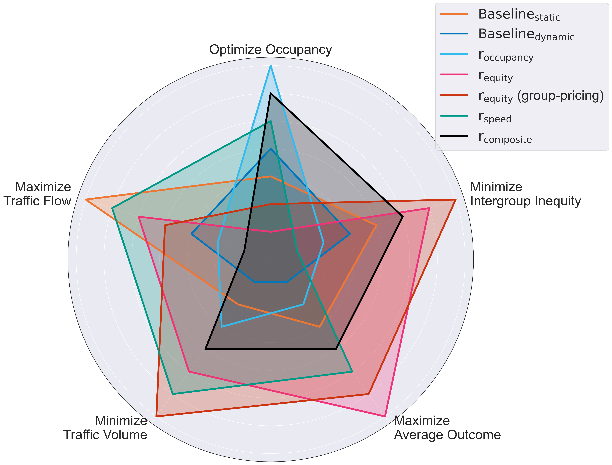

# Pricing Parking for Fairness - A Simulation Study Based on an Empirically Calibrated Model of Parking Behavior



This repository allows for the replication of all experiments conducted for the paper "Pricing Parking for Fairness - A Simulation Study Based on an Empirically Calibrated Model of Parking Behavior" by Jakob Kappenberger, Heiner Stuckenschmidt, and Frederic Gerdon.

*Please note: To protect the privacy of the respondents participating in our survey, we include a synthetic random data set instead of the actual data collected.*

## Setup
*Before beginning, make sure to have 
 [NetLogo 6.3](https://ccl.northwestern.edu/netlogo/download.shtml) installed. On Windows, the installation should be detected automatically. Linux users must specify the respective path.*
```
# Build Environment
cd project_folder
conda env create -f environment.yml
# Activate Environment
conda activate parking-fairness
# Install package
pip install -e .
```

## Using this Repository

**Baseline:**

```
# To run baseline for 100 episodes
cd project_folder/scripts
python run_baseline.py 10 --static
```

- **episodes** (required): Number of episodes to run the baseline for
- **--[m]odel_size**: Size of the NetLogo grid to use (either "training" or "evaluation"(default))
- **--static**: Use static baseline pricing (default False)
- **--[n]etlogo_[p]ath**: Path to NetLogo installation (for Linux users only)
- **--gui**: Boolean for NetLogo UI (default False)

All results are written to the baseline subfolder in the experiments directory with a dedicated timestamp to identify them.

**RL-based Pricing:**

```
# To run RL pricing for 100 episodes on 2 cores with the equity reward function and no group-specific pricing
cd project_folder/scripts
python run_experiment.py ppo_agent_local.json 100 -p 2  --no-group_pricing --adjust_free -r equity --document --eval --early_stopping --normalize --fine_tuning --eval_episodes 3
```

- **episodes** (required): Number of episodes to train for
- **agent** (required): Path to agent JSON config file
- **--num_[p]arallel**: CPU cores to use, defaults to 1
- **--[r]eward_key**: Reward function to use ("occupancy" (default), "n_cars", "equity", "speed", "composite")
- **--[c]heckpoint**: Checkpoint of previous training process, either used to resume training or for evaluation (currently deprecated)
- **--[m]odel_size**: Size of the NetLogo grid to use (either "training"(default) or "evaluation")
- **--[n]etlogo_[p]ath**: Path to NetLogo installation (for Linux users only)
- **--document**: Save plots for min, median and max performances, defaults to True
- **--group-pricing**: Use group-specific pricing for different CPZs.
- **--adjust_free**: Let agent adjust prices freely in interval between 0 and 10, defaults to True
- **--eval**: Run one model instance in evaluation mode, defaults to False
- **--zip**: Zip directory of run after experiment is finished, defaults to False
- **--gui**: Boolean for NetLogo UI (default False)
- **--early_stopping**: Use early stopping for training.
- **--normalize**: Use normalization for state space and rewards.
- **--fine_tuning**: Fine-tune model learned on evaluation model.

All results are written to a subfolder depending on the respective reward function in the experiments directory with a dedicated timestamp to identify them.

